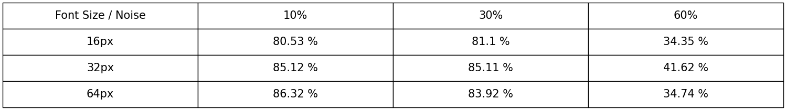

# Hopfield Network 

## Description

A Hopfield network to recover noisy images.
in particular, learn network on `A` to `J` letters and recover noisy images with network.

## Getting Started
### Dependencies
Install dependencies by running following command:
\
```pip install -r requirements.txt```
### Executing
1. To generating original images and noisy images run following command:
\
```python generate_images.py```


2. To learn `Hopfield Network` with generated original images and recover noisy images with learned network run following command:
\
```python hopfield.py```


3. To evaluate the recovered images in comparison with the original images, run the following command:
\
   ```python evaluate.py```
   
### Result
Sample of noisy image and recovered image:

**Noisy image** with `30%` noise and `32px` font. 


**Recovered**


table of accuracy for recovering noisy images for all fonts and `10%`, `30%` and `60%` noise.



### Authors
Amir Rezaei [@ameerezae](https://github.com/ameerezae)
